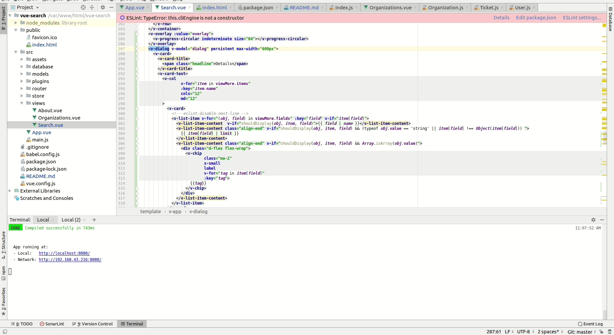

# Vue search application (Demo)

## Description

This application will demostrate how frontend object-relational mapping can use access to the Vuex Store and query serach inside entities and how to use normalized state shape using Vuex and Vuex ORM. 

UI:
Vuetify



## Project setup
```
npm install
```

### Compiles and hot-reloads for development
```
npm run serve
```

### Compiles and minifies for production
```
npm run build
```

### Customize configuration
See [Configuration Reference](https://cli.vuejs.org/config/).
